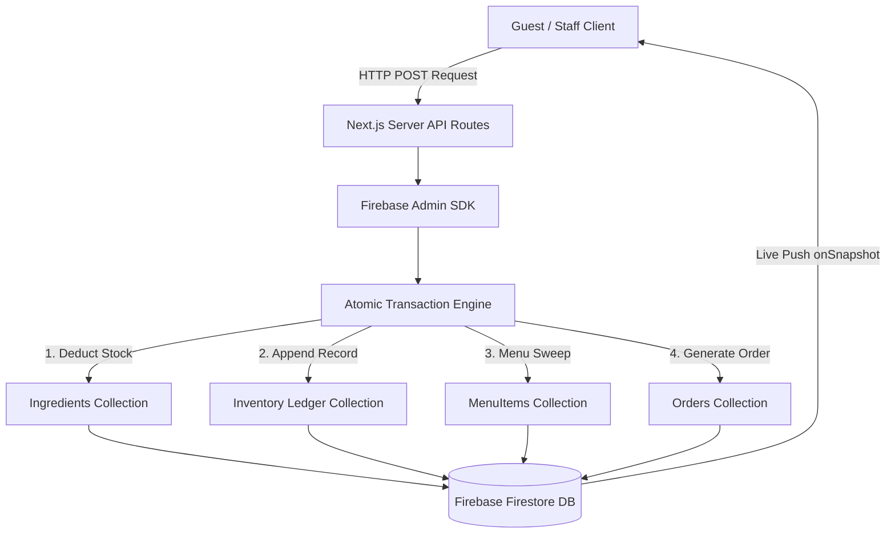
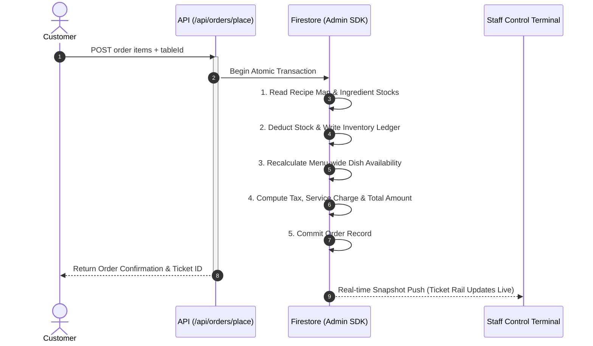

# PlateIQ — Real-Time Ingredient Ledger-Driven Restaurant Management System

> A full-stack restaurant operations platform where dish availability, kitchen alerts, dynamic pricing, and AI recommendations are all computed live from an atomic ingredient stock transaction ledger across the entire menu.

---

## Hosted Application Link

**Live URL:** [https://plateiq-bistro-app.vercel.app](https://plateiq-bistro-app.vercel.app)

---

## Problem Statement Summary

Restaurant staff waste significant time manually updating menu availability and tracking ingredient stock across whiteboard ledgers or spreadsheets. Meanwhile, customers arrive without knowing what is actually available that day, and kitchens routinely discard surplus ingredients that could have been served at a discount rather than thrown away. PlateIQ addresses all three gaps — real-time ingredient-driven availability visible to customers the moment stock changes, a digital ordering and billing workflow for staff, and a dynamic Rescue Menu that surfaces surplus-ingredient dishes with automatic discount pricing before those ingredients expire.

---

## Core Differentiator — The Ingredient Ledger Engine

Every dish in PlateIQ has a `recipeMap`: a list of ingredient IDs and the quantities required per serving. When a customer places an order, a single atomic Firestore transaction simultaneously deducts the required stock from each ingredient document, writes a timestamped entry to the `inventoryLedger` collection, and then recalculates `isAvailable` for **every dish on the entire menu** — not just the ones that were ordered. 

This means that if Paneer Butter Masala, Tandoori Paneer Tikka, and Rasmalai all share the `paneer` ingredient, and an order reduces the paneer stock below any of their required quantities, all three dishes are marked unavailable in the same transaction before the response returns. The same sweep runs on staff restocking events. 

---

## Architecture & Transaction Workflow

### 1. System Architecture Data Flow



### 2. Atomic Order Placement Sequence



---

## Tech Stack

| Layer | Technology |
|---|---|
| Framework | Next.js 16 (App Router) + TypeScript |
| Styling | Tailwind CSS (Parchment Bistro Dark Theme) |
| Database | Firebase Firestore (Real-Time Listeners + Admin SDK Transactions) |
| Authentication | Firebase Auth (Google OAuth 2.0, Passwordless Email Magic Link, Email/Password) |
| Server API | Next.js API Routes (9 routes, all writes via Admin SDK) |
| AI Recommender | Google Gemini (`gemini-flash-lite-latest` via `@google/generative-ai` SDK) |
| Deployment | Vercel (Production Environment) |
| Services Tier | Free tier only — 100% no billing profile attached |

---

## User Stories Completed

### 🥉 Bronze — UI/UX
**Status: Complete.**
Responsive dark-themed UI across all pages. Guest menu board with real-time availability badges, kitchen stock gauges per dish, sold-out overlays, skeleton loaders, and Parchment toast notifications. Staff dashboard with ticket-rail order view, occupancy grid, stock ledger, staff roster, and visual analytics.

### 🥈 Silver — Authentication + Digitized Workflows
**Status: Complete.**

- **Authentication:** Google OAuth 2.0 sign-in (`signInWithPopup`), passwordless email magic link (`sendSignInLinkToEmail`), and password login via Firebase Auth. App-wide real-time auth listener (`onAuthStateChanged`). Staff records stored in Firestore with `admin`, `kitchen`, or `waiter` roles. The `/dashboard` route is protected — unauthenticated users are redirected to `/login`.
- **Menu & Availability:** Live Firestore snapshot on the guest page; availability is recomputed server-side on every order and restock.
- **Ordering:** Customers browse the menu, add items to a cart, select a table, and submit an order. The order placement API runs an atomic transaction (stock deduction + availability sweep + ETA calculation).
- **Billing & Thermal Receipts:** The `billed` status is fully reachable through the UI. Staff can view the itemized bill modal (subtotal, tax %, service charge %, grand total) and print/download an authentic Bistro thermal paper receipt via window print stream.
- **Notifications & Toasts:** Low-stock threshold alerts are written server-side and displayed in the staff dashboard and toast notification feed.

### 🥇 Gold — Management Dashboard
**Status: Complete.**

- **Orders:** Live Kitchen Ticket Rail with status transitions (`placed → preparing → ready → served → billed`).
- **Tables:** Occupancy grid with live status. Staff can reserve tables.
- **Inventory:** Stock levels for all ingredients with restock inputs, surplus flags, and full timestamped ledger.
- **Staff Roster:** Admin-only view of all authenticated staff with role badges and UIDs.
- **Analytics & Visual Charts:** Revenue metrics, visual bar charts for top menu items by units sold, peak ordering hour histograms, and ingredient depletion forecasting.
- **Role-based access:** `kitchen` sees orders + inventory. `waiter` sees orders + tables. `admin` sees everything. Tab content is blocked at the render level (`403 Forbidden`). All write API routes enforce server-side role checks.

### 💎 Platinum — Intelligent Features
**Status: Complete (with beta fallbacks).**

- **AI Sous-Chef (grounded recommender):** Operational with `gemini-flash-lite-latest`. The prompt is grounded to the live list of `isAvailable === true` menu items. When Gemini API quota is unavailable, the endpoint falls back silently to a keyword rule-based engine (vegetarian, spicy, budget, category, ingredient filters) using the same live available-item list.
- **Rescue Menu AI Description Generator (beta):** Dishes with surplus ingredients shown at 15% discount. AI-generated sustainability pitch copy via Gemini. Marked as *(beta)* because if Gemini API quota is exhausted, it displays a static fallback description string.

### 🌟 Bonus — Beyond Problem Statement

- **Smart Table Optimizer (beta):** Customer-facing reservation form (name, party size, time slot). The API runs a greedy best-fit algorithm inside a Firestore transaction — filters by available capacity ≥ party size, sorts by ascending capacity to minimize idle space, assigns the tightest-fit table. Auto-fills the cart's table selector on success. Marked as *(beta)* because automatic reservation release after a time slot passes is not automated (requires a Cloud Function/cron job in production).
- **Closed-loop taste feedback:** Thumbs-up / thumbs-down per dish per anonymous session. Ratings stored in `customerPreferences` and included in the AI Sous-Chef prompt.
- **Sustainability metrics:** ESG widget showing waste-rescued counter. Rescue Menu as a revenue-recovery + waste-reduction mechanism.

---

## AI Usage

1. **AI Sous-Chef** — `POST /api/sous-chef` uses Gemini (`gemini-flash-lite-latest`) to answer natural-language dish queries grounded to only currently available menu items. Customer taste preferences are injected into the system prompt at request time.
2. **Rescue Menu Description Generator** — `POST /api/rescue-description` uses Gemini to write a sustainability pitch for a surplus-ingredient dish.

---

## Setup / Running Locally

```bash
# 1. Clone repository
git clone https://github.com/Saatvik-G/PlateIQ.git
cd PlateIQ

# 2. Install dependencies
npm install

# 3. Copy environment variables
cp .env.example .env.local

# 4. Run development server
npm run dev
```

Open [http://localhost:3000](http://localhost:3000).

---

## Security Notes

All writes to sensitive Firestore collections (`ingredients`, `orders`, `inventoryLedger`, `menuItems`, `tables`, `notifications`, `staff`, `reservations`) are routed exclusively through server-side Next.js API routes using the Firebase Admin SDK with a service account private key. Firestore Security Rules deny direct client-side writes to all of these collections (`allow write: if false`).

---

## Known Limitations / Future Improvements

- **Time-slot reservation conflicts are not auto-released (beta).** Reservations for past time slots remain recorded indefinitely unless cleared by staff.
- **Gemini API quota dependency for Rescue Menu descriptions (beta).** Falls back to a static string when API limits are hit.
- **Single restaurant scope.** Multi-tenancy schema supported (`restaurantId`), but UI targets single-location bistro.

---

## License

This project is licensed under the [MIT License](LICENSE).
